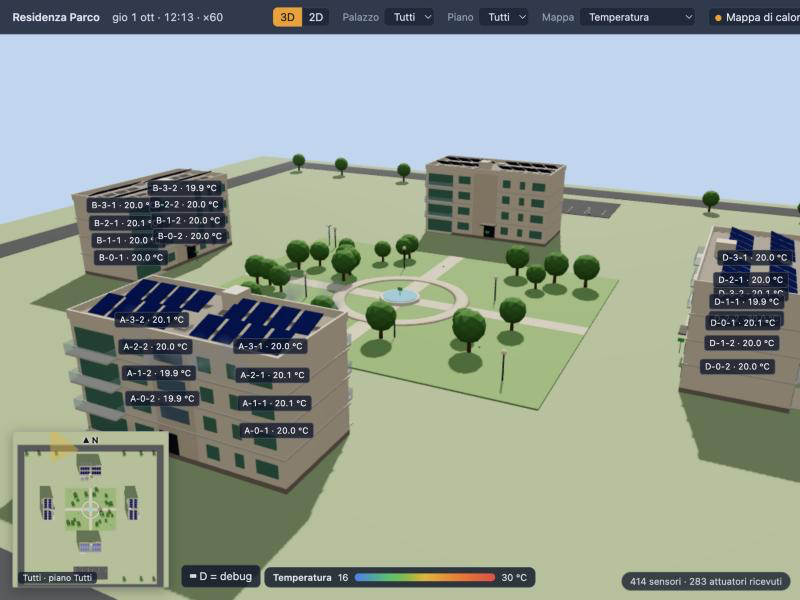
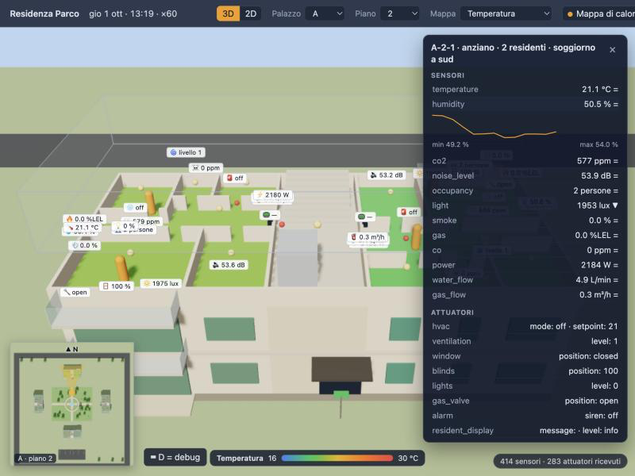
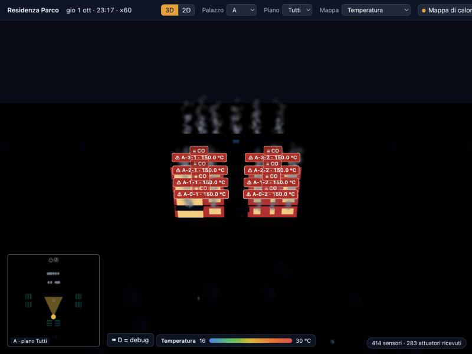

# VISTA 3D — stato, decisioni e guida d'uso

Questo file traccia **cosa deve fare** la vista 3D del complesso residenziale, **quali decisioni** abbiamo preso e **a che punto siamo**. Si aggiorna a ogni decisione o implementazione. È la "Simulation Model" promessa nella sezione 10 della proposta ([`Smart Building Enviromental Manager.md`](Smart%20Building%20Enviromental%20Manager.md#10-simulation-model)).

**Legenda stato:** ✅ fatto · 🟡 in corso · 📐 progettato (nella specifica, da implementare) · ⬜ da fare · ❓ da decidere

**Specifica tecnica della fase 1:** [`docs/superpowers/specs/2026-09-30-vista-3d-design.md`](superpowers/specs/2026-09-30-vista-3d-design.md). È il riferimento ufficiale per nomi, misure, soglie e tappe: se questo file e la specifica non coincidono, **vale la specifica**.

**Ultimo aggiornamento:** 2026-10-02

---

## 0. Dove trovare cosa (guida rapida)

> La **fase 1** della vista 3D è **disponibile**: tutte le tappe T1–T6 del [piano](superpowers/plans/2026-09-30-vista-3d.md) sono completate (sezione 3). Come avviarla e provarla: sezione 3.1; verifica a vista: sezione 3.2.

| Cerco… | Dove si trova | Disponibile da |
|---|---|---|
| **Cosa fa la vista e come** (architettura, scena, interfaccia, errori, test) | [Specifica della vista](superpowers/specs/2026-09-30-vista-3d-design.md) | ✅ T1–T6 |
| **Posizioni e dimensioni** di palazzi, parco e parcheggio (campi `layout`) | `config/complex.json`; formato nella [specifica Monitor v2, §5](superpowers/specs/2026-09-30-monitor-v2-design.md#5-il-modello-del-complesso-configcomplexjson). Nuovi valori dei palazzi (26 m, 3,2 m) nella [specifica della vista, §14](superpowers/specs/2026-09-30-vista-3d-design.md#14-modifiche-fuori-da-view) | ✅ Simulatore; nuovi valori ✅ T2 |
| **Pianta tipo** degli appartamenti (stanze, finestre, balcone, vano scale) | [Specifica della vista, §7.2](superpowers/specs/2026-09-30-vista-3d-design.md#72-pianta-tipo-domainplants); codice in `view/src/domain/plan.ts` | ✅ T2 |
| **Dove sta ogni sensore e attuatore** nella scena | [Specifica della vista, §7.3](superpowers/specs/2026-09-30-vista-3d-design.md#73-posizione-dei-dispositivi-domainplacementts); codice in `view/src/domain/placement.ts` e `layout.ts` | ✅ T2 |
| **Come si vede ogni attuatore** e **ogni emergenza** | [Specifica della vista, §7.4 e §7.8](superpowers/specs/2026-09-30-vista-3d-design.md#74-resa-degli-attuatori); codice in `view/src/domain/actuatorVisual.ts` e `view/src/scene/Devices.tsx` | ✅ attuatori T4 · emergenze T5 |
| **Modello completo espanso** (32 appartamenti, vani scala, dispositivi, layout) | Topic MQTT retained `Complex/model` | ✅ Simulatore, tappa 1 |
| **Misure grezze** dei sensori | `Complex/raw/<area>/<unità>/<sensore>` ([specifica Monitor v2, §7](superpowers/specs/2026-09-30-monitor-v2-design.md#7-contratto-mqtt)) | ✅ Simulatore |
| **Stato degli attuatori** (finestre, tapparelle, luci, sirene…) | `Complex/state/<area>/<unità>/<attuatore>` (retained) | ✅ Simulatore |
| **Ora simulata** (giorno/notte) e **scenari attivi** | `Complex/clock`, `Complex/scenarios` (retained) | ✅ Simulatore |
| **Topic che la vista può leggere e scrivere** (utente MQTT `view`, ACL) | [Specifica della vista, §5](superpowers/specs/2026-09-30-vista-3d-design.md#5-broker-e-sicurezza); file `mosquitto/config/aclfile` | ✅ T1 |
| **Come avviarla** | Sezione 3.1: `docker compose up -d --build mosquitto simulator view`, poi http://localhost:8080 (senza Node-RED, che inoltra a Telegram) | ✅ T1 |
| **Copione della demo** | [Specifica della vista, §13](superpowers/specs/2026-09-30-vista-3d-design.md#13-copione-della-demo-fase-1-circa-4-minuti); provato il 2026-10-01 (sezione 3.2) | ✅ T6 |
| **Arredi e residenti 3D** (modelli esterni CC0, V20) | Modelli in `view/public/models/` (`furniture/`, `people/`); fonti e licenze in [`view/public/models/CREDITS.md`](../view/public/models/CREDITS.md); si rigenerano con `scripts/build-models.sh`. Tabella ingombro → modello in `view/src/domain/furnitureModels.ts`, adattamento in `view/src/scene/modelFit.ts`, residenti in `view/src/domain/residents.ts` e `view/src/scene/People.tsx` | ✅ V20 |
| Prototipo usa e getta dei tre stili (solo riferimento visivo) | `.superpowers/brainstorm/…/content/stile-3d-v2.html` (non versionato) | — |
| Codice della vista 3D | Cartella `view/` (test accanto ai moduli, `npm test`; prova end-to-end in `scripts/e2e_view.py`) | ✅ T1 |

---

## 1. Obiettivo

Mostrare **in tempo reale**, in un modello 3D del complesso dell'Aquila (4 palazzi intorno al parco, parcheggio con colonnine), come gli edifici **reagiscono alle condizioni ambientali** e come il **manager autonomo si adatta**. Serve soprattutto per la **demo all'esame**, che dura pochi minuti.

La vista è **solo una vista**: nessuna logica di simulazione al suo interno. Legge i dati dal simulatore via MQTT.

---

## 2. Decisioni prese

| # | Data | Decisione | Motivo |
|---|------|-----------|--------|
| V0 | 2026-09-30 | **Punti fermi di partenza**: la vista è separata dal simulatore e non simula nulla; legge da MQTT (`Complex/raw`, `state`, `scenarios`, `clock`, `model`, come consentito dalla D14); geometria generata dal codice a partire dai campi `layout` (nessun modello 3D esterno); stile iniziale "plastico architettonico" con appartamenti colorati come mappa di calore | Già stabilito prima della progettazione di dettaglio |
| V1 | 2026-09-30 | **Due fasi.** **Fase 1** (ora): solo il **mondo fisico**, cioè sensori, stato degli attuatori, orologio e scenari, letti dal simulatore già pronto. **Fase 2** (dopo Monitor, Analyzer e Planner v2): si aggiunge uno **strato leggero del manager** (catena MAPE-K: rilevamento → piano → comandi/ack) | Il simulatore basta già per vedere i valori dei sensori. Senza manager gli attuatori cambiano solo con comandi manuali o con gli effetti degli scenari, ma la vista li mostra comunque. Lo strato del manager serve poi a far vedere il *perché* delle reazioni |
| V2 | 2026-09-30 | **Due modalità commutabili: 2D e 3D.** In **2D** una planimetria dall'alto: si sceglie il **piano** (per esempio piano terra = 4 palazzi più il parco; 2° piano = i 4 palazzi al 2° piano) e si può selezionare **un solo palazzo** e poi i suoi **appartamenti** | La planimetria è la vista più leggibile per confrontare appartamenti e piani |
| V3 | 2026-09-30 | **3D navigabile "come un videogioco"**: movimento libero nel complesso; **sensori visibili come oggetti installati** nella scena; **valori in sovraimpressione**; **minimappa** in basso a sinistra con la posizione corrente. Come per il 2D, filtro per piano e per palazzo | Rende la demo coinvolgente e fa capire dove sono i sensori e cosa misurano |
| V4 | 2026-09-30 | **Navigazione 3D con camera da gestionale** (stile The Sims / Cities Skylines): rotazione, zoom e spostamento liberi; clic su un palazzo per avvicinarsi; scelta del piano con **spaccato** (i piani superiori spariscono e si vede dentro, "casa delle bambole"). **Più avanti** (non nella fase 1) un tasto "entra" per la **prima persona** dentro l'appartamento selezionato | Leggibile per chi guarda la demo; niente collisioni né scale percorribili. La prima persona si aggiunge dopo senza rifare nulla |
| V5 | 2026-09-30 | **Interni con pianta tipo**: ogni appartamento ha la stessa pianta generata dal codice (soggiorno con cucina e balcone, due camere, due bagni, ingresso); l'interno 2 usa la pianta dell'interno 1 **ruotata di 180°**. Sensori e attuatori stanno dove starebbero davvero (gas vicino ai fornelli, CO vicino alla caldaia in bagno, contatori e pannello avvisi all'ingresso, fumo a soffitto in cucina, clima in soggiorno, VMC in bagno) | Il modello fisico ha un solo valore per appartamento, quindi le stanze sono scenografia: la mappa di calore colora l'intero appartamento. Rende credibili i sensori "installati" e prepara la prima persona futura |
| V6 | 2026-09-30 | **Architettura del palazzo più realistica**: 26 × 12 m, piani da 3,2 m, zoccolo in pietra, tetto piano con parapetto, **pannelli fotovoltaici** e vano tecnico dell'ascensore. Appartamenti **a destra e a sinistra** del vano scale, **a doppio affaccio**; l'esposizione del modello è quella del **soggiorno** (interno 1 verso il parco con balcone, interno 2 verso la strada). Vano scale al centro con scale, pianerottolo, **ascensore** e, al piano terra, **androne passante verso il parco**. In `complex.json` cambiano solo i campi `layout` (`width_m` 26, `floor_height_m` 3.2). **`area_m2` resta 80**: la vista è scenografica e non in scala sulla superficie interna | Nella prima bozza ogni appartamento era una striscia profonda 6 m e sembrava piccolo. I campi `layout` li usa solo la vista, quindi la fisica non cambia; un volume d'aria più grande abbasserebbe ancora la CO₂, che è già bassa |
| V7 | 2026-09-30 | **Cosa si vede nella fase 1**, oltre ai sensori: (1) giorno/notte dall'ora simulata (sole, ombre, cielo); (2) stato visibile degli attuatori (finestre, tapparelle, luci, clima); (3) emergenze rese "fisiche" (fumo dalle finestre, bagliore del fuoco, sirene lampeggianti, scossa della camera durante il sisma); (4) meteo (pioggia, vento, nuvole); (5) parco (irrigatori, lampioni, segnaletica d'evacuazione); (6) parcheggio (auto presenti, colonnine in carica); (7) energia, in modo leggero (fotovoltaico, batteria); (8) persone negli appartamenti e nel vano scale, secondo i sensori `occupancy`. **Escluso**: traffico sulla strada (nessun dato) | Tutto ciò che si vede deriva da un dato pubblicato dal simulatore; niente decorazioni senza dati |
| V8 | 2026-09-30 | **Nella fase 1 gli attuatori restano fermi**: nel simulatore i residenti non toccano i dispositivi, e ogni attuatore cambia solo con un comando su `Complex/cmd/…`. Per provarli la vista ha un **pannello di debug in sovraimpressione** che manda comandi manuali. Niente "pilota automatico" provvisorio e niente residenti che usano gli interruttori | È una scelta del design del Monitor: il ciclo si chiude solo attraverso il manager. Un mini-Planner provvisorio anticiperebbe la tappa 4 e confonderebbe su chi decide. Nella fase 2 il passaggio da complesso "buio e fermo" a "vivo" sarà la dimostrazione del manager |
| V9 | 2026-09-30 | **Persone evacuate nel parco: rimandate alla fase 2.** Servirà un piccolo topic retained del simulatore (per esempio `Complex/sim/people`: persone in casa, nelle scale e nel parco), vietato al manager come `raw` e `scenarios` | Oggi il conteggio `occupancy.in_park` è solo interno al simulatore. Senza manager nessuna sirena suona, quindi l'evacuazione nella fase 1 non avviene |
| V10 | 2026-09-30 | **Il pannello di debug contiene solo due schede**: (1) **comandi agli attuatori**: si seleziona un dispositivo nella scena e si manda un comando valido per il suo tipo (campi presi dal catalogo di `Complex/model`), con l'esito dell'ack; i comandi partono con `"issued_by": "debug"`; (2) **orologio**: velocità ×1…×60 e salto a un'ora. Si apre in sovraimpressione con un tasto ed è chiuso di default. **Scenari e guasti restano fuori dalla vista**: per ora si avviano con `mosquitto_pub`, poi dalla UI Streamlit v2 (tappa 4). La vista quindi **scrive** solo su `Complex/cmd/…` e `Complex/control/clock` | Scelta dell'utente: la vista resta una vista, con il minimo indispensabile per provare gli attuatori e muoversi nel tempo |
| V11 | 2026-09-30 | **Sovraimpressioni per livello di zoom**: da lontano solo i colori della mappa di calore e le icone di allarme che pulsano; a distanza media un'etichetta per appartamento con la grandezza della mappa di calore (es. "A-2-1 · 23.8 °C"); da vicino (piano tagliato o palazzo selezionato) le icone dei sensori installati con il loro valore; al clic sull'appartamento, la scheda completa | Con 414 sensori non si può mostrare tutto insieme; i dettagli compaiono avvicinandosi, come nei videogiochi di strategia |
| V12 | 2026-09-30 | **Disposizione della schermata**: barra in alto (ora simulata e velocità, 2D/3D, palazzo, piano, grandezza della mappa di calore, stato del simulatore); scheda di dettaglio a destra; **minimappa** in basso a sinistra con il cono della camera; legenda dei colori in basso; debug con un tasto. **Mappa di calore a scelta** tra temperatura (default), CO₂, umidità, rumore, luce, presenze e consumo elettrico; **fumo, gas o CO sopra zero fanno sempre pulsare l'appartamento in rosso**, qualunque grandezza sia scelta | Un'emergenza deve vedersi sempre, anche se si sta guardando un'altra grandezza |
| V13 | 2026-09-30 | **Stile visivo: "realistico stilizzato" di giorno, che di notte sfuma in "digital twin"** seguendo l'ora simulata. Di giorno: intonaco caldo, zoccolo in pietra, vetri, balconi, alberi, strada, cielo e ombre del sole, in stile gestionale; la mappa di calore colora vetri e pavimento dello spaccato. Di notte la scena si scurisce e gli appartamenti si illuminano del colore del dato. In più una **"modalità dati"** stile plastico (volumi chiari, colore solo sui dati) attivabile dalla UI, e la **mappa di calore disattivabile** dalla UI. **Minimappa** = secondo rendering della stessa scena dall'alto, con nord, piano corrente e cono della camera | Di giorno sembra una casa vera; di sera dati ed emergenze risaltano, e il passaggio a ×60 è il momento più scenografico della demo. Prototipo di confronto dei tre stili nella lavagna di brainstorming (`.superpowers/brainstorm/`, non versionata) |
| V14 | 2026-09-30 | **Tecnologia: React + React Three Fiber** (Three.js a componenti) con **drei** (camera, etichette HTML, minimappa, cielo, istanze), **zustand** (stato), **mqtt.js** (MQTT su WebSocket), **Vite** e **TypeScript**; test con **vitest**. Container statico `view` (build Node, servito da nginx). Il browser si collega **direttamente a Mosquitto via WebSocket** con un **utente MQTT dedicato `view`** e una ACL; niente gateway intermedio. Il 2D è la stessa scena vista dall'alto con camera ortografica | drei offre già quasi tutto ciò che è stato deciso (V4, V11, V12, V13); le parti di UI sono React normale; la scena si genera dal modello come albero di componenti. 41 messaggi al secondo non richiedono un gateway. Scartati Three.js puro (troppo codice di collegamento a mano) e Babylon.js (ecosistema a parte, GUI meno comoda) |
| V15 | 2026-09-30 | **Broker**: listener WebSocket sulla porta 9001 e `acl_file` in Mosquitto; **utente `view`** che legge `model`, `clock`, `scenarios`, `status/#`, `raw/#`, `state/#`, `ack/#` e scrive solo `cmd/#` e `control/clock`; `admin` mantiene accesso completo per gli altri servizi. Configurazione del browser generata all'avvio del container da `VIEW_MQTT_URL`, `VIEW_MQTT_USERNAME`, `VIEW_MQTT_PASSWORD` | Le credenziali nel browser sono leggibili: permessi minimi. Con l'ACL attiva ogni utente deve essere elencato, altrimenti i servizi esistenti si fermerebbero |
| V16 | 2026-09-30 | **Dati**: ora simulata fatta avanzare localmente tra un messaggio di `Complex/clock` e l'altro; valori **interpolati** nell'arco di un periodo di campionamento; stati discreti animati in 0,5 s; sensore **"non aggiornato"** dopo 3 periodi senza misure (solo resa grafica); **storico breve** di 10 minuti in memoria; comandi di debug con attesa dell'ack per 5 s ("nessun ack" altrimenti) | Colori e sole fluidi anche a ×60; i guasti `offline` e `no_ack` si vedono senza logica in più |
| V17 | 2026-09-30 | **La scena mostra solo ciò che dicono i dati**: fumo, fuoco, gas, sisma e pulsazione rossa derivano dai sensori e dagli stati, con soglie solo visive; `Complex/scenarios` serve solo per l'elenco nella barra. Con la mappa di calore spenta le emergenze pulsano comunque | Ciò che si vede è ciò che vedrebbe il Monitor: la vista non "sa" in anticipo cosa succede |
| V18 | 2026-09-30 | **Sei tappe** (sezione 3) e **copione della demo** della fase 1 di circa 4 minuti (specifica §13) | Ogni tappa ha un risultato verificabile; il pannello di debug arriva presto (T3) per provare gli attuatori nelle tappe successive |

| V19 | 2026-10-01 | **Arredi di base e dispositivi realistici come scenografia**: geometrie procedurali, arredi solo sul piano tagliato, interni ruotati di 180°, ingombri e passaggi verificati con test. Sensori con forme dedicate e LED di famiglia; animazioni e identificatori dei dispositivi conservati | Eccezione esplicita a V7 («niente decorazioni senza dati») per migliorare l’immersione nella demo: la scenografia non rappresenta nuovi dati né decide azioni. Meno del 40% del pavimento di ogni stanza è coperto; la mappa di calore resta leggibile. Quattro geometrie unite per appartamento, materiali condivisi giorno/notte/dati, nessuna luce aggiuntiva |
| V20 | 2026-10-02 | **Modelli 3D esterni per arredi e persone** (supera la parte di V0 "nessun modello 3D esterno" e le geometrie procedurali di V19): **arredi Kenney Furniture Kit** (CC0) adattati agli ingombri già definiti in `domain/furniture.ts`; **residenti Quaternius "Ultimate Modular"** già vestiti (CC0), animati. Nello spaccato i **muri restano interi** (circa 2,9 m) invece che tagliati a 1,1 m. **Pavimento in legno** di base; con la mappa di calore attiva il pavimento prende il colore del dato. La caldaia resta disegnata a codice (il pacchetto non la contiene) | Prova usa e getta del 2026-10-02: aspetto molto migliore delle forme procedurali, stile low-poly coerente tra arredi e persone, licenze CC0 verificate nei file dei pacchetti. I personaggi base Quaternius "Universal" sono stati scartati perché privi di vestiti (gli abiti abbinati sono solo fantasy). ✅ **Implementata il 2026-10-02** (sezione 3.2). Dettagli decisi durante l'implementazione: 8 personaggi, 4 donne e 4 uomini ("Ultimate Modular Males", CC0); nello spaccato i muri di casa sono quelli della prima persona, con vani finestra e porte, e ante e tapparelle si vedono anche lì; i dispositivi stanno alle quote reali; la planimetria 2D resta com'era (muri a 1,1 m, dispositivi bassi) |

---

## 3. Piano delle tappe (fase 1)

| Tappa | Contenuto | Risultato verificabile | Stato |
|---|---|---|---|
| T1 | Mosquitto (WebSocket, ACL, utente `view`), servizio `view` (nginx, `config.js`), collegamento MQTT, store, banner di stato | La pagina mostra "414 sensori · 283 attuatori ricevuti" | ✅ |
| T2 | `layout` dei palazzi a 26 m e 3,2 m; scena statica dal modello (palazzi, stanze, parco, parcheggio), camera, filtri palazzo e piano, 2D/3D, minimappa | Il complesso è navigabile e tagliabile per piano, in 3D e in 2D | ✅ |
| T3 | Pannello di debug: comandi agli attuatori e orologio | Un comando manuale produce l'ack; il salto alle 22:00 cambia l'ora | ✅ |
| T4 | Dati vivi: mappa di calore interpolata, sovraimpressioni per zoom, scheda con storico breve, attuatori animati, persone, auto | Aprendo una finestra dal debug la si vede aprirsi; i colori seguono le misure | ✅ |
| T5 | Atmosfera ed emergenze: giorno→notte, meteo, fumo, fuoco, sirene, sisma, modalità dati | Un incendio avviato con `mosquitto_pub` si vede nascere e propagarsi | ✅ |
| T6 | Documentazione (questo file con la checklist visiva, MONITOR.md, README) e prova del copione della demo | Il copione funziona da capo a fondo | ✅ |

**Fase 2** (dopo Monitor, Analyzer e Planner v2): strato leggero del manager, persone evacuate nel parco (V9), prima persona (V4). Avrà una sua specifica.

### 3.1 Come avviarla e provarla

**Avvio (demo):**

```bash
docker compose up -d --build mosquitto simulator view
```

poi http://localhost:8080. **Non avviare Node-RED** né l'intero stack: inoltra gli allarmi a un canale Telegram reale. La build Docker esegue `npm run check` e `npm test`: se falliscono, l'immagine non si costruisce.

**Sviluppo** (Node 22 o successivo): `cd view && npm install && npm run dev`, poi http://localhost:5173 (serve comunque `mosquitto` e `simulator` in Docker). Solo in sviluppo gli store sono raggiungibili dalla console del browser come `window.__view` (per esempio `window.__view.useUiStore.getState().setFloor(2)`).

**Test:**
- unitari: `cd view && npm test` e `npm run check`;
- end-to-end (stack avviato): `uv run --no-project --python 3.11 --with 'paho-mqtt>=2,<3' python scripts/e2e_view.py` (5 controlli: pagina, dati via WebSocket, `admin` su 1883, comando di debug con ack, ACL che vieta gli scenari a `view`).

**Utente MQTT `view`:** la password è in `.env` (`VIEW_MQTT_PASSWORD`). Per cambiarla o ricrearla:

```bash
docker run --rm -v "$PWD/mosquitto/config:/mosquitto/config" eclipse-mosquitto:2 mosquitto_passwd -b /mosquitto/config/passwordfile.txt view viewpassword123
```

poi `docker compose restart mosquitto`. I permessi sono in `mosquitto/config/aclfile`.

**Comandi da tastiera:** `D` pannello di debug, `H` mappa di calore, `M` modalità dati, `2`/`3` planimetria 2D o vista 3D, `Esc` deseleziona. Doppio clic su un palazzo per volarci; clic su un appartamento (o un dispositivo) per la scheda di dettaglio; clic sulla minimappa per spostare la vista.

**Scenari** (restano fuori dalla vista, V10):

```bash
docker exec iot_mosquitto mosquitto_pub -u admin -P adminpassword123 -t Complex/control/scenario -m '{"action":"start","scenario":"fire","target":"A-2-1"}'
```

### 3.2 Verifica a vista

Ripercorsa il 2026-10-01 nel browser (container su :8080 e server di sviluppo su :5173), insieme al copione della demo (specifica §13). ✅ = visto; ☐ = da ricontrollare a occhio alla prossima prova.

**Modelli esterni, muri interi e pavimento in legno (V20)**

- [x] Palazzo A, piano 2 (3D): arredi Kenney nei due interni, cucina in 5 pezzi, TV sul mobile, caldaia a codice; residenti animati, diversi per appartamento e posto
- [x] Muri interi a 2,9 m con vani finestra (portafinestra sul balcone), porte interne con architrave e ingresso aperto; vano scale con muri interi
- [x] Pavimento: legno a mappa di calore spenta; legno tinto del colore del dato a mappa accesa, con la venatura visibile
- [x] Dispositivi alle quote reali nello spaccato 3D (termostato e CO₂ a 1,5 m, split a 2,4 m)
- [x] Prima persona dentro A-2-1: arredi, pavimento in legno e residente animato
- [x] Planimetria 2D: muri a 1,1 m come prima, arredi visti dall'alto
- [x] Modalità dati: arredi con materiale neutro, colore solo sul pavimento
- [x] Vano scale: residenti che salgono la rampa, in piedi sui gradini
- [x] Prestazioni (browser integrato, 800 × 1023 px, dpr 2): circa 100 fps con il piano 2 tagliato e 8 residenti; 52 fps con 80 residenti, il limite (occupazione alzata solo nel browser)
- [x] Peso al primo caricamento: 34 file, circa 2,4 MB (arredi 454 KB, personaggi 1,98 MB); container `view` ricostruito e verificato
- [x] Notte alle 22:00 (orologio forzato solo nel browser): arredi leggibili con la tenue emissione della palette, pavimento del colore del dato; i residenti restano sagome scure
- [ ] Incendio con i nuovi arredi e muri interi: non riprovato

**Arredi e dispositivi realistici (V19)** (superati da V20: arredi procedurali e muri a 1,1 m)

- [x] Palazzo A, Piano 2: cucina, divano, pranzo con quattro sedie, camere, bagni e ingresso arredati nei due interni, ruotati di 180°; arredi da balcone dal primo piano
- [x] Planimetria 2D (`2`): disposizione leggibile dall’alto e passaggi liberi; i test controllano anche i dodici posti delle persone
- [x] Giorno e modalità dati (`M`): materiali caldi e tessuti di giorno, bianco carta in modalità dati
- [x] Notte alle 22:00 (`D` → Orologio): materiali blu scuro con tenue emissione, senza luci nuove; mappa di calore leggibile
- [x] Clic sulla sirena nella scena: scheda di A-2-1 e selezione di `A-2-1.alarm` nel debug; gli arredi lasciano passare il puntatore
- [x] Rotazione della camera con otto appartamenti arredati: misura locale di 5 s, circa 120 FPS, 95° percentile degli intervalli 8,8 ms nel browser integrato a 639 × 998 pixel; non è una garanzia su altri portatili o risoluzioni
- [ ] Ricontrollare da vicino tutte le animazioni dei nuovi involucri (girante VMC, valvola aperta/chiusa, display con i tre livelli); nella sessione sono stati provati i comandi `alarm` e `hvac` in `cool`, poi ripristinati

Gli arredi usano 33 ingombri conservativi per interno, di cui tre sul balcone (30 al piano terra). Anche i dettagli delle geometrie sono verificati rispetto agli ingombri e all’altezza di 1,1 m. Il basamento del pavimento di 0,12 m è incluso nell’altezza. Armadi, docce, caldaia e appendiabiti sono rappresentati in sezione; la doccia usa il telaio del vetro per lasciare leggibile il pavimento. Tappeti piccoli, senza sovrapposizioni. Le persone mantengono tutti i posti originali.

I dispositivi mantengono il contratto di `placement.ts`: soltanto la resa dello spaccato abbassa soffitto e split a 1,25 m, e i dispositivi a parete a un massimo di 1 m. Non vengono modificati coordinate di pianta, modello o messaggi. Il quadro contatori è unico, con tre strumenti selezionabili individualmente; la tastiera richiama lo stesso dispositivo della sirena. Le geometrie e i materiali locali vengono liberati allo smontaggio, i materiali condivisi seguono la palette esistente. Nessun modello esterno, texture scaricata o nuova dipendenza.

**Attuatori (specifica §7.4)**

- [x] `window`: ante ruotate di 70° (verso l'esterno, per restare visibili) su tutte le finestre dell'appartamento
- [x] `blinds`: tapparella abbassata di (100 − `position`) %
- [x] `lights`: lampade a soffitto sul piano tagliato; di notte finestre accese in proporzione a `level`
- [x] `hvac`: split con flusso di particelle rosse in `heat`
- [ ] `hvac` in `cool`: flusso blu (stesso codice di `heat`, non guardato da vicino)
- [ ] `ventilation`: griglia che ruota con `level` (troppo piccola per vederla negli screenshot)
- [ ] `gas_valve`: maniglia parallela/perpendicolare (visto lo stato nell'etichetta, non la maniglia)
- [x] `alarm`: lampeggiante rosso sul soffitto del disimpegno
- [ ] `evacuation_siren`: lampeggiante rosso sul pianerottolo
- [x] `resident_display`: pannello colorato con il messaggio ("Prova", giallo)
- [ ] `stair_lights`: spente, normali, `evacuation` verdi lampeggianti
- [x] `smoke_vent`: botola sollevata sul tetto
- [x] `elevator`: `recall` con porte aperte e spia rossa
- [x] `battery`: barra con `soc_pct` e freccia in carica
- [x] `irrigation`: getti d'acqua agli irrigatori
- [x] `park_lights`: lampioni accesi
- [x] `evacuation_signs`: cartelli verdi luminosi all'uscita degli androni e al centro del parco
- [x] `ev_charger`: auto presente con `car_connected`, LED che pulsa in carica

**Emergenze (specifica §7.8)**

- [x] Pulsazione rossa con `smoke`, `gas` o `co` sopra il riposo, anche con la mappa di calore spenta
- [x] Fumo dalle finestre e dal vano scale, che si estende agli appartamenti vicini
- [x] Fuoco: bagliore arancione tremolante nelle finestre
- [x] Gas: foschia verdastra sul piano tagliato (fuga in B-1-2)
- [x] Monossido: icona "☠ CO" sull'appartamento
- [ ] Sisma: scossa della camera (0,42 m a 5,8 Mw: non distinguibile negli screenshot)
- [x] Allarmi: lampeggiante rosso (`alarm`)

**Navigazione e stile**

- [x] 3D ↔ 2D (`2`/`3`): planimetria ortografica, nord in alto, piano terra di default, niente rotazione
- [x] Filtro palazzo (gli altri sbiaditi, volo sul palazzo) e filtro piano (spaccato e piani superiori fantasma)
- [x] Minimappa con nord, palazzo e piano correnti, cono della camera; clic per spostare la vista
- [x] Giorno → notte: alba a ×60, digital twin di sera con finestre accese e contorni azzurri, sole basso d'inverno
- [x] Meteo: pioggia, cielo coperto, alberi che ondeggiano, anemometro
- [x] Modalità dati (`M`): stile plastico, colore solo sui dati
- [x] Mappa di calore spenta (`H`): nessuna tinta, legenda nascosta, emergenze ancora rosse
- [x] Sensori non aggiornati (simulatore fermo): grigio tratteggiato, "non aggiornato" nella scheda, banner "simulatore non in linea"

| Giorno, panoramica | Piano tagliato con scheda | Notte, incendio |
|---|---|---|
|  |  |  |

---

## 4. Domande aperte

- ✅ ~~Revisione della specifica scritta~~: approvata il 2026-09-30
- ✅ ~~Revisione del [piano di implementazione](superpowers/plans/2026-09-30-vista-3d.md) e scelta del modo di esecuzione~~: piano approvato, esecuzione in linea
- ✅ ~~Relazione tra 2D e 3D~~: stessa scena, camera ortografica dall'alto (V14)
- ✅ ~~Collegamento del browser a MQTT e credenziali~~: WebSocket, utente `view` con ACL (V15)
- ✅ ~~Prestazioni e interpolazione~~: V16 e specifica §10
- ✅ ~~Efficacia nella demo~~: copione nella specifica §13 (V18)
- ✅ ~~Suddivisione in tappe~~: sezione 3 (V18)
- ✅ ~~Il simulatore non pubblica quante persone sono nel parco~~: rimandato alla fase 2 (V9)
- ✅ ~~Senza manager gli attuatori non cambiano mai stato~~: accettato per la fase 1, con il pannello di debug (V8)
- ✅ ~~La UI Streamlit è ancora v1~~: orologio dal pannello di debug; scenari con `mosquitto_pub` fino alla UI v2 (V10)

---

## 5. Storico modifiche

| Data | Modifica |
|------|----------|
| 2026-09-30 | Creato questo documento; avviata la progettazione |
| 2026-09-30 | Decisioni V1–V3: due fasi (prima il mondo fisico, poi lo strato del manager), modalità 2D a planimetria, 3D navigabile con sensori, sovraimpressioni e minimappa |
| 2026-09-30 | Decisione V4: navigazione 3D con camera da gestionale e spaccato; prima persona rinviata |
| 2026-09-30 | Decisioni V5–V6: pianta tipo con stanze e sensori "installati"; palazzo 26 × 12 m più realistico (doppio affaccio, ascensore, androne verso il parco, fotovoltaico sul tetto) |
| 2026-09-30 | Decisioni V7–V9: cosa si vede nella fase 1; attuatori fermi senza manager e pannello di debug per i comandi manuali; persone nel parco rimandate alla fase 2 |
| 2026-09-30 | Decisione V10: il pannello di debug manda solo comandi agli attuatori e controlla l'orologio; scenari e guasti restano a `mosquitto_pub` e alla UI Streamlit v2 |
| 2026-09-30 | Decisioni V11–V12: sovraimpressioni per livello di zoom; disposizione della schermata; mappa di calore a scelta con le emergenze sempre in rosso |
| 2026-09-30 | Decisione V13: stile realistico stilizzato che di notte sfuma in digital twin, più modalità dati e mappa di calore disattivabili; minimappa come secondo rendering dall'alto |
| 2026-09-30 | Decisione V14: React Three Fiber, container statico `view`, collegamento diretto al broker via WebSocket |
| 2026-09-30 | Design approvato in 5 sezioni (decisioni V15–V18); scritta la specifica della fase 1; aggiunti la guida "Dove trovare cosa" e il piano delle tappe |
| 2026-09-30 | Specifica approvata; scritto il piano di implementazione (15 task, tappe T1–T6) |
| 2026-09-30 | Tappa T1 completata: WebSocket 9001, ACL e utente `view` in Mosquitto; servizio `view` (nginx, `config.js`); collegamento MQTT, store e banner di stato |
| 2026-09-30 | Tappa T2 completata: `layout` dei palazzi a 26 m e 3,2 m; scena statica generata dal modello (palazzi con pianta tipo, parco, parcheggio); camera, filtri palazzo e piano, 2D/3D, minimappa, barra in alto e scorciatoie |
| 2026-09-30 | Tappa T3 completata: pannello di debug (tasto D) con comandi agli attuatori validati sul catalogo, registro con esito dell'ack, orologio (velocità e salti); prova end-to-end 5/5 |
| 2026-09-30 | Tappa T4 completata: mappa di calore interpolata con legenda, etichette per livello di zoom, selezione e scheda di dettaglio con storico breve, attuatori animati, persone e auto |
| 2026-09-30 | Tappa T5 completata: sole dell'Aquila dall'ora simulata e passaggio giorno → digital twin notturno, modalità dati, pioggia, vento e nuvole, fumo, fuoco, gas, CO e scossa del sisma derivati dai sensori |
| 2026-10-01 | Tappa T6 completata: guida d'avvio e verifica a vista (sezioni 3.1–3.2), README e `MONITOR.md` aggiornati, copione della demo provato da capo a fondo; fase 1 disponibile |
| 2026-10-01 | V19: arredi procedurali sul piano tagliato e dispositivi realistici, con palette giorno/notte/dati e selezione preservata; TDD su ingombri, passaggi, persone, superficie libera, altezze reali delle geometrie e sensori nei quattro palazzi. Verifica 2D/3D e misura FPS locale; 122 test, controllo TypeScript e build superati |
| 2026-10-02 | Prova usa e getta di modelli esterni; decisione V20: arredi Kenney, residenti Quaternius vestiti, muri interi nello spaccato, pavimento in legno o colore della mappa di calore |
| 2026-10-02 | V20 implementata con TDD: asset in `view/public/models/` (26 arredi Kenney e 8 personaggi Quaternius, 4 donne e 4 uomini, compressi con meshopt) e `scripts/build-models.sh`. Arredi istanziati e adattati con scala uniforme; residenti animati (al massimo 80); muri interi con vani finestra nello spaccato 3D; dispositivi alle quote reali; pavimento in legno generato a codice; 2D invariata. Eliminate le geometrie procedurali di arredi e persone. 154 test, controllo TypeScript, build e immagine Docker superati |
